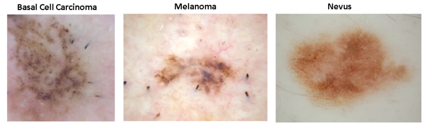
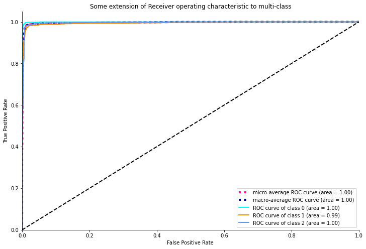

# Skin Cancer Detection with Transfer Learning Deep CNN
By utilizing **Transfer Learning** method, we will build **Deep Convolutional Neural Networks** for detecting three major skin cancers: Basal Cell Carcinoma, Melanoma, and Nevus.

```
Domain             : Computer Vision, Machine Learning 
Sub-Domain         : Deep Learning, Image Recognition
Techniques         : Deep Convolutional Neural Network, Transfer Learning, MobileNetV2
Application        : Image Recognition, Image Classification, Medical Imaging
```

## Project Highlight

``` 
1. Detected 3 types of skin cancer from Skin Lesion images using Transfer Learning architecture with 12,295 Skin Lesion images 
(Basal Cell Carcinoma : 3273 images, Nevus (Benign) : 4550 images, Melanoma : 4472 images).
2. 97.80% accuracy was achieved with a customized model based on the MobileNetV2 Network.
3. GradCAM visualization has been added to produce a coarse localization map that highlights the concept-relevant regions in the image.
```

### Dataset: 
**Dataset : [ISIC Skin Cancer Challenge 2019](https://challenge.isic-archive.com/data/#2019) (9.1GB)**


```
- The original dataset contains 25,331 JPEG images of skin lesions with 9 different skin cancer types
- For researching and faster development purpose, I have reduce the number of skin lesions to 12,295 with 3 different skin cancer types:
    - Basal Cell Carcinoma : 3273 images
    - Nevus (Benign) : 4550 images
    - Melanoma : 4472 images  
```
**The sample images of Basal cell Carcinoma, Melanoma and Nevus are shown in figure below:**

```
Dataset Details
Dataset Name            : ISIC Skin Cancer Images (Basal Cell Carcinoma vs Melanoma vs Nevus)
Number of Class         : 3
Number/Size of Images   : Total      : 12445 (555 MB)
                          Training   : 12295
                          Testing    : 150
```
**_Data pre-processing workflows:_** <br>
[[00 - Skin Cancer Data Preparation.ipynb]](https://github.com/zacharyvunguyen/Skin-Cancer-Detection-with-Transfer-Learning-Deep-CNN/blob/d9a227470733ee2e4c41e0cb083158652f12ca1f/00%20-%20Skin%20Cancer%20Data%20Preparation.ipynb)

### Result 

```
Performance Metrics 
Test Accuracy                                    : 97.80%
Precision                                        : 98%
Sensitivity (BCC)                                : 99% 
Sensitivity (Melanoma)                           : 97% 
Sensitivity (Nevus)                              : 98%
F1-score                                         : 98%
AUC                                              : 0.99
```

**ROC AUC**<br>



**_Model-building workflow:_** <br>
[01_Skin_Cancer_Classification_with_MobileNetV2_Model_Building_(Final).ipynb](https://github.com/zacharyvunguyen/Skin-Cancer-Detection-with-Transfer-Learning-Deep-CNN/blob/9bb2cb94f05340a2049fc858eabefd1105116ff9/01_Skin_Cancer_Classification_with_MobileNetV2_Model_Building_(Final).ipynb)

**GradCAM visualization**

| Skin lesion                       | Skin lesion with GradCAM                |
|-----------------------------------|-----------------------------------------|
|  |  |

**_Visual explaination GradCAM workflow:_** <br>
[02_Skin_Cancer_Classification_Visual_explanation_GradCAM.ipynb](https://github.com/zacharyvunguyen/Skin-Cancer-Detection-with-Transfer-Learning-Deep-CNN/blob/d9a227470733ee2e4c41e0cb083158652f12ca1f/02_Skin_Cancer_Classification_Visual_explanation_GradCAM.ipynb)
